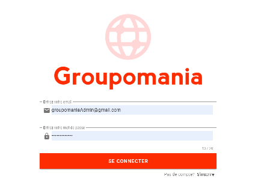

# Projet 7 Openclassrooms: Groupomania

Le projet consiste à construire un réseau social interne pour les employés de Groupomania.
Le but de cet outil est de faciliter les interactions entre collègues.
Le département RH de Groupomania a laissé libre cours à son imagination pour les fonctionnalités 
du réseau et a imaginé plusieurs briques pour favoriser les échanges entre collègues.

<p align="center">

</p>

### Pré-requis

Cloner le projet,
ensuite en étant à la racine du projet  lancer

```$cd server 
$ npm install
$cd ../client
$npm install```

Assurez vous d'avoir "nodemon" d'installer également.

### Installation

Pour que les données de l'application soient stockées il faut se connecter à notre base de données.
Sur le projet les identifiants ne sont pas fournis mais le code utilise le chemin de mes variables d'environnement 
je vous conseille donc de créer les mêmes dans le dossier server ``$cd server``

Créer le dossier config
  ``$ mkdir config``
  ``$ cd config``
 
Créer le fichier authConfig.js 
``$ touch authConfig.js``
  avec ce modèle:
    module.exports = {
    secret: 'clé JWT',
    admin: 'clé d'accés création de compte admin' };

Créer le fichier config.js
  ``$ touch config.js``
  avec ce modèle:
    module.exports = {
    database: 'nom de la base de donnée',
    user: 'utilisateur',
    port: 'port',
    password: 'mot de passe',
    options: {
      dialect: 'mysql',
      host: 'localhost',  },
    };
    
Créer également le dossier statique images qui va recevoir les fichiers multimédias des utilisateurs
    ``$ cd ..``
    ``$ mkdir images``

Il faut initialiser la table "roles" dans mysql
  pour cela j'ai créé une fonction dans server/models/index.js de la ligne 34 à 99
  qu'il vous suffit de décommenter et de commenter à la place db.sequelize.sync(); ligne 42.
  Ceci va créer deux utilisateurs avec le rôle admin et user.
  Si vous préférer les créer vous même sacher que la clé dans authConfig est demandé 
  dans la requête pour accepter la création de compte admin`

## Démarrage

Lancer deux terminals distincts :
  le premier sur => 
  ``cd server``
  ``npm start``
  
  le deuxième sur => 
  ``cd client``
  ``npm run serve``

## Fabriqué avec

* [animate.css](https://animate.style) - Library CSS 
* [Vue.js](https://vuejs.org/) - Framework Front-end
* [Vuetify](https://vuetifyjs.com/en/) - Design Framework
* [node.js](https://nodejs.org/en/) - JavaScript runtime
* [MySQL](https://www.mysql.com/fr/) - Database Service
* [Express.js](https://expressjs.com/fr/) - Framework Back-end


